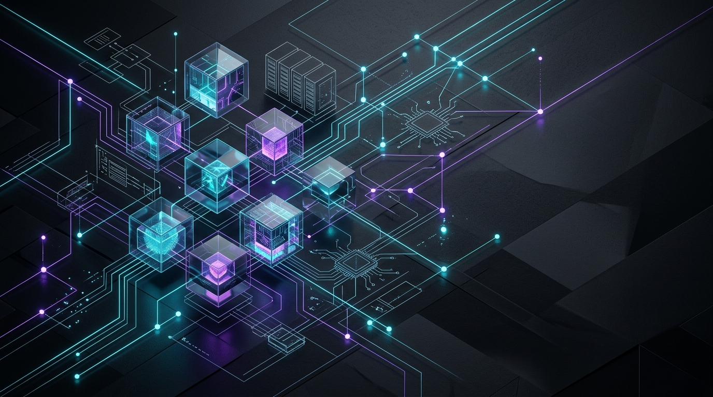

  
    
  
  <h1>⚡ Md. Saimon Hasan Emon</h1>
  
<b>Backend Engineering &nbsp;|&nbsp; AI Systems Architect &nbsp;|&nbsp; CSE Student</b>

  
<i>Building scalable backend architectures, high-performance APIs, and retrieval-augmented AI systems.</i>

  

    
    
    
    
    
    
  

---

### 🧠 About Me

I am a Computer Science & Engineering student specializing in **backend development** and **intelligent AI systems**. My engineering approach focuses on designing clean API abstractions, optimizing database queries for high throughput, and integrating modern AI models (RAG, LLMs, Computer Vision) into production workflows.

* 🛠️ **Core Expertise:** Distributed systems design, RESTful API architecture, & RAG pipelines.
* 🎓 **Academic Background:** Computer Science & Engineering student preparing for Software Engineering (SWE) roles.
* 🎯 **Engineering Values:** Code reliability, clean architecture, algorithm efficiency, and continuous learning.

---

### 🛠️ Tech Stack & Ecosystem

| Domain | Technologies & Tools |
| :--- | :--- |
| **Backend Engineering** |      |
| **AI & Machine Learning** |    |
| **Databases & Data** |   |
| **Frontend & Fullstack** |      |
| **DevOps & Tools** |     |

---

### 🚀 Featured Engineering Projects

<table>
  <tr>
    <td width="50%" valign="top">
      <h3 align="center">🏥 MediSA</h3>
      
<b>AI Healthcare Assistant</b>

      
An intelligent healthcare assistant leveraging <b>FastAPI</b>, <b>PostgreSQL</b>, and custom <b>FRAG / RAG architectures</b> for accurate medical information retrieval and context-aware responses.

      

        <b>Tech Stack:</b> Python · FastAPI · PostgreSQL · RAG Architecture
      

      

        <a href="https://github.com/saimonemon46/mediSA"><b>📂 Explore Repository »</b></a>
      

    </td>
    <td width="50%" valign="top">
      <h3 align="center">🎓 UniMind</h3>
      
<b>Academic Intelligence Platform</b>

      
A comprehensive university intelligence platform featuring AI-driven academic workflows, automated resource processing, and interactive query handling.

      

        <b>Tech Stack:</b> Python · Django · React · RAG
      

      

        <a href="https://github.com/saimonemon46/UniMind"><b>📂 Explore Repository »</b></a>
      

    </td>
  </tr>
  <tr>
    <td colspan="2" valign="top">
      <h3 align="center">💡 LeetCode & Algorithmic Solutions</h3>
      
<b>Problem Solving & Data Structures</b>

      
Curated repository containing optimal solutions to complex algorithmic problems, focusing on clean Python implementations, time/space complexity optimization, and software engineering interview preparation.

      

        <b>Tech Stack:</b> Python · Data Structures · Algorithms 
        <a href="https://github.com/saimonemon46/leetcode-solutions"><b>📂 Explore Repository »</b></a>
      

    </td>
  </tr>
</table>

---

### 📊 GitHub Activity & Insights

  
  

  

  

---

### 🎯 Current Focus & Growth

- 🏛️ **System Architecture:** Studying distributed backend patterns, caching strategies, and event-driven architectures.
- ⚡ **Algorithmic Mastery:** Daily problem-solving on LeetCode & Codeforces to sharpen Data Structures & Algorithms.
- 🤖 **Advanced AI Pipelines:** Enhancing hybrid vector retrieval models and RAG latency optimization.

 

  

  <i>"Engineering software with precision, scalability, and purpose."</i>

